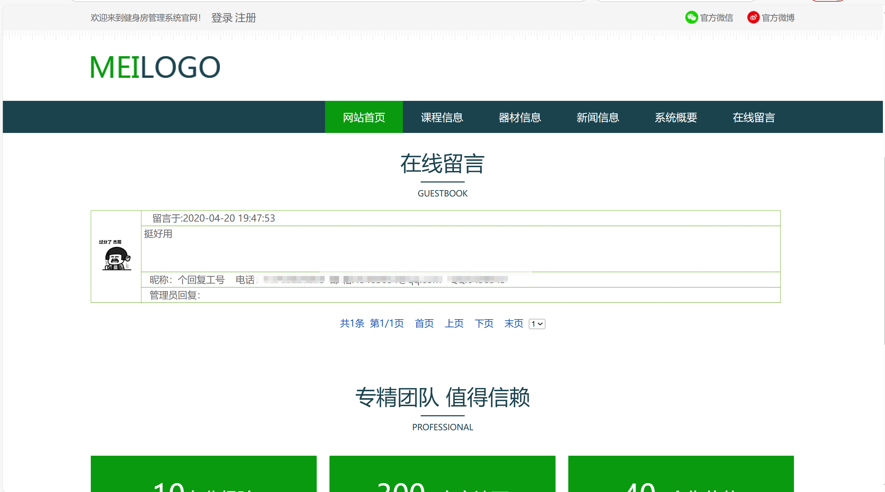

# jspServlet028
jspServlet028健身房管理系统+BG
 
## 源码问题查看主页咨询

### 一、关键词

健身房管理系统，健身系统

### 二、作品包含
源码+数据库+设计报告文档+全套环境和工具资源+本地部署教程

### 三、项目技术
前端技术：Html、Css、Js、Jquery、Bootstrap
后端技术：Java、JSP、Servlet、JDBC

### 四、运行环境（以下版本亲测，其他版本兼容性请自行测试）
开发工具：IDEA/eclipse

数据库：MySQL5.7或8.0

服务器：Tomcat8.5或Tomcat9.0

数据库管理工具：Navicat10以上版本

环境配置软件： JDK1.8

浏览器：谷歌浏览器

### 五、项目介绍
项目编号：jspServlet028

随着人们物质和生活的日渐丰富和提高，越来越多的人开始舍得为自己的健康进行投资，更加渴望拥有强健的体魄，而这必须要有科学有效的健身活动。

系统按照使用的角色主要分为三个模块：管理员和用户以及教练功能模块。除了对于公共开放的模块外，每个模块下的分支功能不一样，每个功能都可实现基础的增删改查需求，对各模块实现的功能做出如下说明。
（1）管理员操作模块：对普通的用户进行管理，以及维护系统的环境、实现对系统广告的更新、视频资源的上传、健身器材的维护、用户留言的监管、系统的维护以及公告信息发布等功能。
（2）用户操作功能模块：用户注册账号、课程在线报名、提交健身、器材信息搜索、查看健身指数分析、在线查询用户留言、管理个人资料用户信息、重置账号和密码等功能。
（3）教练操作功能模块：可以注册账号、发布健身课程、对课程实现增删改查、查询课程报名记录、管理个人资料信息等功能。

### 六、运行截图

